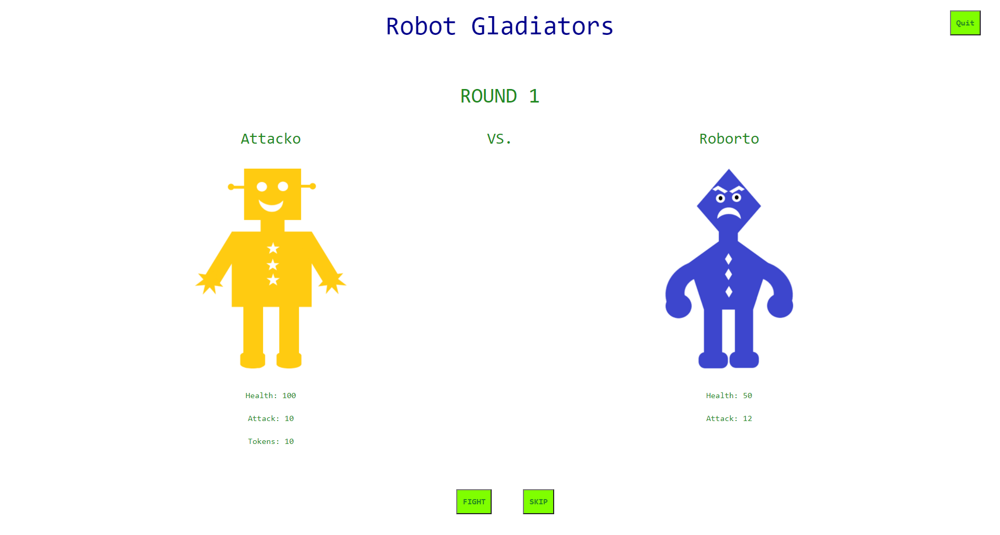
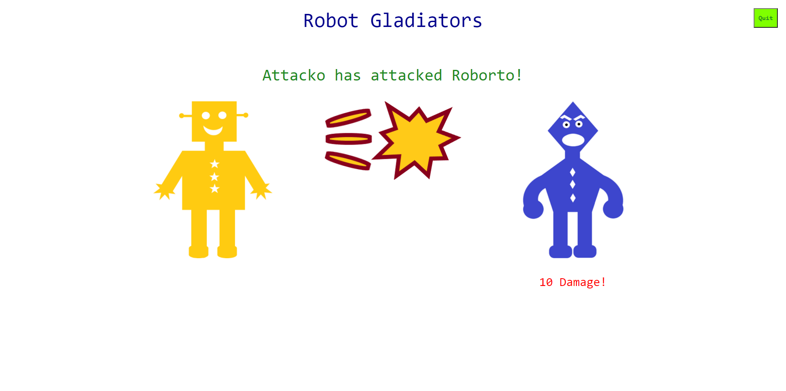

# Robot Gladiators

## Table of Contents
* [Deployed](#deployed)
* [Description](#description)
* [Technologies](#technologies)
* [Usage](#usage)
* [Preview](#preview)
* [Questions](#questions)
* [Credits](#credits)

## Deployed
Access the application [here](https://sarawrmas.github.io/robot-gladiators/)

## Description
Robot Gladiators is a RPG originally created with a series of JavaScript prompts. The application is currently undergoing maintenance to become a fully functional graphic game built with React! Check back soon for updates.

## Technologies
* React
* JavaScript
* Bootstrap

## Usage
To begin, name your fighter.

Your gladiator will fight 3 battles with 3 enemies: Roborto, Androida, and Cyberion. For each turn, you can choose to fight or skip.

If you choose to fight, your robot will attack the enemy robot and their health will decrease. They will attack back and decrease your health. The round continues until one robot gladiator runs out of health, or if you choose to skip.

If you skip, 10 coins will be deducted from your balance and you will move on to the next round.

If you win the round, you will earn coins that can be used at the store between rounds to refill your health by 20 points or upgrade your attack by 6 points.

At the end of game, should you emerge victorious, you can enter your score into the database and see how did compared to other players. If your health runs out before you reach the final enemy, your gladiator will die and the game will restart.

## Preview
### Start:

### Fight!

## Questions
Have questions about this project?  
GitHub: https://github.com/sarawrmas  
Email: sara.m.adamski@gmail.com

## Credits
Sara Adamski